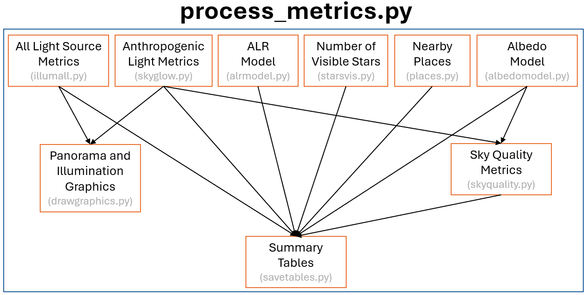

# NSNSD Night Skies CCD Camera Data Reduction Pipeline

A Python package for National Park Service [Natural Sounds and Night Skies Division (NSNSD)](https://www.nps.gov/orgs/1050/index.htm) staff to process and analyze all-sky imagery acquired with the CCD Camera System ([Dan Duriscoe et al. 2007](https://iopscience.iop.org/article/10.1086/512069)) to assess light pollution impacts on parks' night sky resources.


## Table of Contents

<!-- MarkdownTOC autolink=true depth=3 bracket=round -->

- [Required Software and Install Procedures](#required-software)
- [Preparing Data For Processing](#preparing-data-for-processing)
- [Running the Pipeline](#running-the-pipeline)
- [Processing Flow Chart](#processing-flow-chart)
- [Image Processing Module Documentation](#image-processing-module-documentation)
  <!-- - [1. Reduction](#1-reduction)
  - [2. Registration](#2-registration)
  - [3. Pointing Error](#3-pointing-error)
  - [4. Zeropoint and Extinction](#4-zeropoint-and-extinction)
  - [5. Median Filter](#5-median-filter)
  - [6. Galactic and Zodiacal Coordinates](#6-galactic-and-zodiacal-coordinates)
  - [7. Galactic Mosaic](#7-galactic-mosaic)
  - [8. Zodiacal Mosaic](#8-galactic-and-zodiacal-coordinates)
  - [9. Full-resolution Mosaic](#9-galactic-and-zodiacal-coordinates)
  - [10. Median-filtered Mosaic](#10-galactic-and-zodiacal-coordinates)
  - [Public domain](#public-domain) -->
- [Natural Sky Modeling Module Documentation](#natural-sky-modeling-module-documentation)
  <!-- - [1. Finalize Terrain Mask](#1-finalize-terrain-mask)
  - [2. Airglow Model](#2-airglow-model)
  - [3. A.D.L. Model](#3-atmospheric-diffuse-light-adl-model)
  - [4. Galactic Model](#4-galactic-model)
  - [5. Zodiacal Light Model](#5-zodiacal-light-model)
  - [6. Observed Sky Brigtness](#6-load-observed-sky-brightness-mosaic)
  - [7. Combined Natural Sky Model](#7-combined-natural-sky-model)
  - [8. Anthropogenic Light Mosaic](#8-anthropogenic-light-mosaic)
  - [9. Mosaic Analysis](#9-mosaic-analysis) -->
- [Sky Brightness Metrics Module Documentation](#sky-brightness-metrics-module-documentation)

<!-- /MarkdownTOC -->


----------------------------------

## Required Software and Install Procedures

### Required Software
  - ArcGIS Pro 3.3 or later
  - Adobe Photoshop
  - conda (recommended to use [Miniforge](https://github.com/conda-forge/miniforge) for new installs)
  - Python packages:
    - `arcpy astropy matplotlib scikit-image photutils numpy pandas scipy pillow dbfread`

### Setting up a Conda Environment

ArcGIS Pro comes with a pre-built conda environment called **arcgispro-py3** that is setup to use arcpy. The easiest way to get arcpy functionality into a new conda environment is to clone the **arcgispro-py3** environment and then install additional packages as needed. The following steps provide setup instructions for a Windows machine:

1. Add path to **arcgispro-py3** environment to your conda configuration file:
   - `conda config --add envs_dirs “C:\Program Files\ArcGIS\Pro\bin\Python\envs”`
2. Clone **arcgispro-py3** to create a new environment named **ccd**:
   - `conda create --clone arcgispro-py3 --name ccd`
3. Copy the **pinned** file from the **arcgispro-py3** environment to the **ccd** environment:
   - `cp "C:\Program Files\ArcGIS\Pro\bin\Python\envs\arcgispro-py3\conda-meta\pinned" "C:\Users\<YourUsername>\AppData\Local\miniforge3\envs\ccd\conda-meta"`
4. Install other necessary packages into **ccd** environment:
   - `conda activate ccd`
   - `conda install astropy scikit-image photutils`
   - `pip install dbfread`

### Troubleshooting your Installation

Below are a few common issues that have been encountered during installation or during initial attempts at executing the processing pipeline:

1. SSL Certificate Errors during package installation or when downloading online content:
   - Try installing the pip-system-certs package, using the `--cert` argument if needed to pass in a certificate file:
      - `pip install pip-system-certs`
      - `pip install pip-system-certs --cert="path/to/CertFile.cer"`
2. lxml DLL error when running arcpy commands:
   - Uninstall and re-install the lxml package, making note of which version (e.g. 5.1.0) of lxml is being used:
      - `pip uninstall lxml`
      - `pip install lxml==5.1.0`


## Preparing Data For Processing

The directory structure assumed by the pipeline looks as follows, with a description of the primary contents of each folder to the right:
```
CCD 
└─── Data                          -Contains the filelist.xlsx processing list
│    └─── calibdata                -Calibrated images and data validation outputs
│    └─── fielddata                -Raw images and calibration files
│    └─── graphics                 -Final all-sky skyglow images per data set
│    └─── griddata                 -ArcGIS grids and mosaics per data set
│    └─── maps                     -ArcGIS map templates for producing graphics
│    └─── rasters                  -Master ArcGIS grids for natural sky modeling
│    │    └─── scratch_fullres     -ArcGIS workspace for full-resolution mosaics
│    │    └─── scratch_galactic    -ArcGIS workspace for Galactic model mosaics
│    │    └─── scratch_median      -ArcGIS workspace for median-filtered mosaics
│    │    └─── scratch_metrics     -ArcGIS workspace for claculating skyglow metrics
│    │    └─── scratch_natsky      -ArcGIS workspace for natural sky mosaics
│    │    └─── scratch_zodiacal    -ArcGIS workspace for Zodiacal model mosaics
│    └─── spreadsheets             -Spreadsheet templates and various catalogs
│    └─── standards                -Standard star catalogs for photometric calibration
│    └─── tables                   -Summary tables with metadata and light pollution metrics
│ 
└─── Images
│    └─── Linearity Curves         -Master linearity curves per CCD camera
│    └─── Master                   -Master Flat/Bias/Thermal images per CCD camera
│ 
└─── Scripts                       -Houses the pipeline scripts contained in this repository
```

Raw data that will be processed by the pipeline lives in the `CCD --> Data --> fielddata` directory, where each night of data should be separated into individual sub-folders named using the 4-letter park code and UTC date of data collection (e.g. ROMO241004 for data collected from Rocky Mountain NP on 2024 October 4th). Within a night's data folder will be additional sub-folders, one per data set collected:

```
CCD 
└─── Data
     └─── fielddata
          └─── ROMO241004
               └─── 1st
               └─── 2nd
               └─── 3rd
               └─── ...
```

### Before running the processing pipeline, you will need to:

1. Setup up the CCD directory tree as shown above. You can download the [zipped CCD Folder](data/CCD.zip) which contains the proper directory structure, though it is empty of any data, calibration, or ArcGIS grid files you will need to run the pipeline. If you wish to run the pipeline, please [contact the Natural Sounds and Night Skies Division](https://www.nps.gov/subjects/nightskies/contactus.htm) to inquire about obtaining the necessary calibration and grid files.
2. Within the `CCD` directory, clone this repository into a folder named `Scripts`:
```
cd "\path\to\CCD"
git clone https://github.com/zvanderbosch/nightskies_fork.git Scripts
```
3. Ensure raw data is placed in the `fielddata` directory.
4. In the `filepath.py` script, make sure the `base` parameter points to the location of the `CCD` directory on your local machine.
5. In the `filepath.py` script, update the `apikey` parameter with your own [Astrometry.net](https://nova.astrometry.net/) API key. This will be needed for image plate solving.
6. Modify the `filelist.xlsx` file, which should be located in the `CCD --> Data` directory. This file tells the pipeline which data sets are going to be processed. An example `filelist.xlsx` file is provided [here](data/filelist.xlsx), and has the following fields:
   - `Dataset`: Name of data night to process (e.g. ROMO241004)
   - `Process`: Yes or No, whether to process this dataset
   - `V_band`: Yes or No, whether to process V-band images
   - `B_band`: Yes or No, whether to process B-band images
   - `Flat_V`: Name of master flat file used to calibrate V-band images
   - `Flat_B`: Name of master flat file used to calibrate B-band images
   - `Curve`: Name of linearity response curve file used to calibrated images
   - `Zeropoint`: The default zeropoint (mag) for the CCD camera used
   - `Processor`: Name of data processor with first initial and last name (e.g. J Doe)
   - `Central_AZ`: Azimuth coordinate to place at the center of final panoramic graphics
   - `Location`: Descriptive park name (e.g. Rocky Mountain NP)

## Running the Pipeline

Pipeline operation is broken down into four main steps:

1. `process_images.py`: Calibrate raw images, solve image coordinates, stitch images together to create all-sky mosaics, and generate corresponding Galactic and Zodiacal model mosaics.
2. `Adobe Photoshop`: Create the terrain mask.
3. `naturalsky.py`: Generate the combined natural sky model and subtract it from the observed all-sky mosaics to create an anthropogenic skyglow mosaic.
4. `process_metrics.py`: Calculate complete set of sky brightness metrics and generate final output images.

Assuming you are working from a command line interface, such as Windows Terminal or Powershell, and have completed the [conda environment setup](#setting-up-a-conda-environment) and [data preparation steps](#before-running-the-processing-pipeline-you-will-need-to) above, an example pipeline processing workflow for a dataset named **ROMO241004** would look like the following:

> ### Step 1: Activate conda Environment and Process Images
> ```powershell
> conda activate ccd
> cd "\path\to\CCD\Scripts"
> python process_images.py
> ```
> ### Step 2: Data Entry in Calibration Report Excel File
> Use Excel to open the `calibreport.xlsx` file saved in `CCD --> Data --> calibdata --> ROMO241004`. Manually edit the **DATA QUALITY**, **BORTLE CLASS**, **ZLM**, and **NARRATIVE** fields with approriate values based on visual obserations from the data collection site, and save changes to the file.
> ### Step 3: Edit the Terrain Mask
> Use Adobe Photoshop to edit the `mask.tif` file saved in `CCD --> Data --> griddata --> ROMO241004 --> mask`, refining the horizon boundary and setting all above-horizon pixels as white and all below-horizon pixels as black.
> ### Step 4: Generate the Natural Sky Model
> ```powershell
> python naturalsky.py ROMO241004 1 V --airglowzenith=45
> ```
> ### Step 5: Data Entry for Natural Sky Model
> The `naturalsky.py` script will generate an Excel file `natsky_model_params.xlsx` located in the `CCD --> Data --> calibdata --> ROMO241004` folder. Edit the **Quality Flag** and **Notes** columns for each data set, indicating the quality of the natural sky model subtraction on a scale of 0 (bad) to 5 (excellent) and using the Notes column to describe any problems encountered.
> ### Step 6: Generate Light Pollution Metrics 
> ```powershell
> python process_metrics.py
> ```
> ### Step 7: Final Data Entry
> The `process_metrics.py` script will save a summary of the data processing results into an Excel file named `ROMO241004.xlsx`, located in the `CCD --> Data --> tables` folder. A few data fields, listed below, require manual entry and/or checking to make sure values are correct:
> ```
> NIGHT METADATA Sheet:
> └─── CAMERA           -Camera type
> └─── LENS             -Lens type
> └─── FILTER           -Filter ID code
> └─── INSTRUMENT       -Instrument name
> └─── ZLM              -Zenith limiting magnitude (from calibreport.xlsx)
> └─── BORTLE           -Bortle class (from calibreport.xlsx)
> └─── SQM              -SQM measured value
> └─── OBS_1 - OBS_4    -Observer names
> └─── NARRATIVE        -Visual observations narrative (from calibreport.xlsx)
>
> SET METADATA Sheet:
> └─── GLARE            -Glare quality rating (0-5)
> └─── ATMOSPHERE       -Atmospheric quality rating (0-5)
> └─── COLLECTION       -Data collection quality rating (0-5)
> └─── PROCESSING       -Data processing quality rating (0-5)
> └─── REFERENCE        -Reference data set for the night? (Y or N)
> └─── USEABLE          -Is data set useable? (Y or N)
> └─── CLOUDS           -Cloud cover (0-100%)
> └─── PLUMES           -Volcanic plume coverage (0-100%)
> └─── PCT20            -20-micron particle count (ppm)
> └─── COLLECTION_NOTES -Data collection notes
>
> CALIBRATION Sheet:
> └─── BAD_FRAMES       -Number of bad images
> └─── CALIB_NOTES      -Calibration quality notes
> ```

The `naturalsky.py` script is the only script that has both required and optional command line arguments. Required arguments are the data Night (ROMO241004), data Set (1) and filter Name (V) in that order. The optional arguments available are related to input parameters for the natural sky model and are listed below along with their default values:

```python
--elevation     # (Site elevation [m], Default = FITS header value)
--extcoeff      # (Extinction coefficient [mag/airmass], Default = Best-fit value)
--airglowzenith # (Zenight Airglow [nL], Default = 20)
--airglowheight # (Height of emitting airglow layer [km], Default = 90)
--airglowext    # (Airglow extinction factor, Default = 0.6)
--adlfactor     # (Atmospheric Diffuse Light factor, Default = 1.2)
--galext        # (Galactic light extinction factor, Default = 0.9)
--zodext        # (Zodiacal light extinction factor, Default = 0.6)
```


## Image Processing Module Documentation

<p align="center">
  
</p>

### 1. Reduction

#### Purpose: 
This script performs basic image reduction, including corrections for bias, dark, flat, and linearity response of the detector.

#### Source code
`process_images.py` > `reduce_images()` > `reduce.py` > `reducev()` and `reduceb()`  

#### Methods
In the beginning of data collection, for each data set, 5 dark ($\large D$) images showing the thermal noise and 5 bias ($\large B$) images showing the read noise were taken alternately for calibration purposes. Each dark image is then processed here as following to obtain the calibrated dark ($\large D_c$) image:

$$\huge D_c=L(D-B) $$

where $\large L$ is the linearity curve for correcting the detector response. Then, the script creates the master dark image $\large D_m$ through averaging the 5 calibrated darks and the master bias image $\large B_m$ through averaging the 5 biases. While collecting scientific images, an additional 50 x 50 pixels small bias image was taken immediately after each scientific image. We use these small bias images to track the bias drift over the course of the observation. We compute the bias drift $\large B_d$ by subtracting the average value of the central 50 x 50 pixels of the master bias from the average pixel value of each one of the small bias images. This measured bias drift information is saved in _biasdrift.txt_ and _biasdrift.png_ in the calibdata folder. To obtain calibrated scientific images $\large S_c$, we use the following equation:

$$\huge S_c=\frac{(S-B_M-B_D)(L-D_m)}{F} $$
 
where $\large S$ is the raw scientific image and $\large F$ is the flat image taken and processed in the lab. All of the terms in the above equation are 2D image arrays except for $\large B_d$ and $\large L$ which are single-value scale factors. This script outputs calibrated science images in both _fits_ and _tiff_ formats. 


### 2. Registration

#### Purpose: 
This script will register the pointing of the images to the sky coordinates by matching the position of standard stars captured in the image to the position from the Tycho2 catalog. This script uses the `PinPoiot.Plate` object (through ACP Observatory Software) for the matching process. 

#### Source code: 
`process_images.py` > `register_coord()` > `register.py` > `matchstars()`

#### Methods: 
The script first reads in the reduced images. If the image contains the horizon, the script will mask the part of the image below ~2 degrees in elevation. Then, the script uses the `PinPoiot.Plate` object (through ACP Observatory Software) to compare the position of the standard stars in the images to the Tycho2 catalog. If the image cannot be solved, it will try solving the image with only the central 200 x 200 pixels. If the images still can't be solved, it will be skipped. The script will return a list of files solved with the cropped images and a list of files that are failed to be solved. If an image is solved successfully, the image header will be updated with the solved coordinate information.


### 3. Pointing Error

#### Purpose: 
This script calculates the pointed azimuth and altitude using the solved `RA` and `Dec` values from the image headers. If the images are not solved, the `RA`, `Dec`, `AZ`, and `ALT` values are interpolated. The output from this script will be used later for making the mosaic. 

#### Source code: 
`process_images.py` > `pointing_error()` > `pointing.py` > `pointing_err()`

#### Methods: 
It reads in the solved `RA` and `Dec` values from the image header, updates the coordinates to the observed date, translates to the azimuth and altitude given the LAST and the longitude, interpolates `RA`, `Dec`, `AZ`, and `ALT` values if the images are not solved, updates the headers, and records these values in a text file.


### 4. Zeropoint & Extinction

#### Purpose: 
This script finds the best-fit extinction coefficient and the instrumental zeropoint. These values are needed for the photometric calibration later. 

#### Source code: 
`process_images.py` > `fit_zeropoint()` > `extinction.py` > `extinction()`

#### Methods: 
This script finds the best-fit extinction coefficient and the instrumental zeropoint by identifying the standards stars in the images using PinPoiot.Plate object, measuring their background-subtracted flux in [DN/s] through aperture photometry with source aperture radius = 3 pixels and ring-shaped background with radius extending from 4 to 8 pixels, computing their airmass through their elevation, comparing the measured flux to their absolute magnitude, and finally fitting for the extinction given the airmass and M-m for all of the standard stars. The best-fit was found through `numpy.polyfit()` with the uncertainties of the best-fit parameters estimated using the covariance matric. This script outputs a list of the standard stars used for fitting, a graphical display of the fitting result, and the best-fit extinction coefficient and zeropoint.


### 5. Median Filter

#### Purpose: 
This script applies median filter to each image to remove the stars. The filtered images will show the sky background brightness.

#### Source code: 
`process_images.py` > `apply_filter()` > `medianfilter.py` > `filter()`

#### Methods: 
We first read in the plate scale from the header of a solved image. Then we set the filter mask radius to be ~ 0.5 degree, which translates to a radius of 18 pixels for ML3 and ML4 CCD cameras. This filter size was selected to ensure most (or all) point sources are effectively filtered out, and the median value in that filtered window is a good representation for the background brightness. This script uses multiprocessing to speed up the filtering process for all the images. Here, MaxIM DL is used to convert the filtered _fits_ images to _tiff_ images so that they are compatible with ArcGIS to make mosaics in the future.


### 6. Galactic & Zodiacal Coordinates

#### Purpose: 
This script calculates ecliptic and galactic coordinates and rotation angles of the images. These output coordinates will be used in producing natural sky model for the given location, date, and time specific to the data set.

#### Source code: 
`process_images.py` > `compute_coord()` > `coordinates.py` > `galactice_ecliptic_coords()`

#### Methods: 
The script reads in the longitude and latitude from the image header. It also reads in the registered image coordinates in azimuth and altitude from the input file. Then, it uses ACP to calculate the corresponding galactic and zodiacal coordinates. The output coordinates are saved in a text file for the future use of making the mosaic images of galactic and zodiacal model.


### 7. Full-resolution Mosaic

#### Purpose: 
This script makes the whole sky mosaic from the full resolution images according to the location of observed sky. This script also generates ArcGIS shapefiles used to define the spatial extent of each image. The Median, Galactic, and Zodiacal mosaic steps use these shapefiles as inputs to perform image clipping and match exactly the per-image extent of the full-resolution mosaic.

#### Source code: 
`process_images.py` > `mosaic_full()` > `fullmosaic.py` > `mosaic()`

#### Methods: 
This script reads in the full resolution _tiff_ files and the pointing error file. It also uses some premade raster templates from the raster folder. We use arcpy (ArcGIS) to manipulate the images with projection, removal of distortion, clipping, and mosaic. Note that the mosaic raster list must start with an image with maximum pixel value being greater than 256 to avoid _“no data”_ in the final mosaic. We then read in the zeropoint from the input file and use it to convert the mosaic from the raw unit in data number (**DN**) to calibrated unit in magnitudes per square arcsecond using the following equation: 

$$\huge M_c=Z-2.5\log_{10}\left(\frac{M_r}{tP^2}\right) $$

where $\large M_c$ is the mosaic in calibrated unit of magnitudes per square arc second, $\large Z$ is the instrumental zeropoint magnitude, $\large M_r$ is the mosaic in raw unit of **DN**, $\large t$ is the exposure time, and $\large P$ is the plate scale in arcsecond per pixel. The photometrically calibrated raster and layer files are stored in the Griddata folder.


### 8. Median-filtered Mosaic

#### Purpose: 
This script makes the whole sky mosaic from the median filtered images according to the location of observed sky.

#### Source code: 
`process_images.py` > `mosaic_median()` > `medianmosaic.py` > `mosaic()`

#### Methods: 
Same as the method section under [_“full-resolution mosaic”_](### Full-resolution Mosaic)  with the exception of using median filtered images as the input. This module also creates the initial `mask.tif` file, used for generating the terrain mask.


### 9. Galactic Mosaic

#### Purpose: 
This script makes the whole sky mosaic of the galactic model according to the time and location of the observed sky.

#### Source code: 
`process_images.py` > `mosaic_galactic()` > `galactic.py` > `mosaic()`

#### Methods: 
This script reads in some premade raster templates from the raster folder.  Then it reads in the galactic coordinates and the pointing error from the input files. We use `arcpy` (ArcGIS) to manipulate the images with rotation, projection, clipping, and mosaic. The output raster and layer files are stored in the Griddata folder.


### 10. Zodiacal Mosaic

#### Purpose: 
This script makes the whole sky mosaic of the zodiacal model according to the time and location of the observed sky.

#### Source code: 
`process_images.py` > `mosaic_zodiacal()` > `zodiacal.py` > `mosaic()`

#### Methods: 
This script reads in some premade raster templates from the raster folder.  Then it reads in the zodiacal coordinates and the pointing error from the input files. We use `arcpy` (ArcGIS) to manipulate the images with rotation, projection, clipping, and mosaic. The output raster and layer files are stored in the Griddata folder.


## Natural Sky Modeling Module Documentation

<p align="center">
  
</p>

The `naturalsky.py` script is somewhat unique compared to the `process_images.py` and `process_metrics.py` routines in that all of the sub-routines are internal to the `naturalsky.py` script as class objects rather than broken out into individual python scripts.


### 1. Finalize Terrain Mask

#### Purpose: 
This class finalizes the terrain mask so it can be used for clipping/masking procedures in later steps.

#### Source code: 
`naturalsky.py` > `Mask()`

#### Methods: 
This class reads in the `mask.tif` file after it has been edited with Adobe Photoshop. We use `arcpy` (ArcGIS) to project the mask into the fisheye equal area coordinate system and set values below the horizon to `NoData` and values above the horizon to zero. The final mask raster, `maskd.tif`, is stored in the Griddata folder.


### 2. Airglow Model

#### Purpose: 
To generate the airglow component of the natural sky model.

#### Source code: 
`naturalsky.py` > `Airglow()`

#### Methods: 
This class uses `arcpy` (ArcGIS) to generate the airglow brightness model according to the van Rhijn equation ([Leinert et al. 1998](https://ui.adsabs.harvard.edu/abs/1998A%26AS..127....1L/abstract)) and applying atmospheric extinction. The extincted model is saved to the Griddata directory. This module also saves all natural sky model input parameters to the excel sheet `natsky_model_params.xlsx` in the Calibdata directory. The van Rhijn equation is written as:

$$\huge I_z = \frac{I_0}{\sqrt{1-\left[(R+\ell)/(R+h)\right]^2\sin^2z}} $$

where $\large I_z$ is the airglow brightness as a function of zenith angle, $\large z$, $\large I_0$ is the airglow brightness directly overhead at zenith, $\large R$ is the Earth's radius, $\large \ell$ is the elevation of the observing site, and $\large h$ is the height of the airglow emitting layer.


### 3. Atmospheric Diffuse Light (ADL) Model

#### Purpose: 
To generate the atmospheric diffuse light component of the natural sky model.

#### Source code: 
`naturalsky.py` > `ADL()`

#### Methods: 
This class uses `arcpy` (ArcGIS) to load in a pre-generated all-sky model of atmospheric diffuse light for Mauna Kea, Hawaii (see [Kwon et al. 2004](https://ui.adsabs.harvard.edu/abs/2004NewA...10...91K/abstract) and [Duriscoe et al. 2013](https://ui.adsabs.harvard.edu/abs/2013PASP..125.1370D/abstract)) and applies a linear scaling factor.


### 4. Galactic Model

#### Purpose: 
To generate the galactic component of the natural sky model.

#### Source code: 
`naturalsky.py` > `Galactic()`

#### Methods: 
This class uses `arcpy` (ArcGIS) to load in the Galactic mosaic generated in a [previous step](#9-galactic-mosaic) and apply atmospheric extinction scaled by a linear constant. The extincted model is saved to the Griddata directory.


### 5. Zodiacal Light Model

#### Purpose: 
To generate the zodiacal light component of the natural sky model.

#### Source code: 
`naturalsky.py` > `Zodiacal()`

#### Methods: 
This class uses `arcpy` (ArcGIS) to load in the Zodiacal light mosaic generated in a [previous step](#10-zodiacal-mosaic) and apply atmospheric extinction scaled by a linear constant. The extincted model is saved to the Griddata directory.


### 6. Load Observed Sky Brightness Mosaic

#### Purpose: 
To load in the observed sky brightness mosaic and prepare it for subtraction of the natural sky model.

#### Source code: 
`naturalsky.py` > `Skybright()`

#### Methods: 
This class uses `arcpy` (ArcGIS) to load in the observed median-filtered sky brightness mosaic, convert pixel values from mag/arcsec$^2$, project the mosaic into the fisheye equal-area coordinate system, and apply the finished terrain mask. This prepares the observed sky brightness mosaic to have the natural sky model subtracted. The masked mosaic is saved to the Griddata directory.


### 7. Combined Natural Sky Model

#### Purpose: 
To add the component models into a combined natural sky model.

#### Source code: 
`naturalsky.py` > `AggregateModel()`

#### Methods: 
This class uses `arcpy` (ArcGIS) to add together the component natural sky models ([Airglow](#2-build-airglow-model), [A.D.L](#3-build-atmospheric-diffuse-light-adl-model), [Galactic](#4-build-galactic-model), and [Zodiacal](#5-build-zodiacal-light-model)) into a combined natural sky model, project the resulting model into the fisheye equal-area coordinate system, and apply the finished terrain mask. This prepares the natural sky model to be subtracted from the observed sky brightness mosaic. The combined natural sky model is saved to the Griddata directory.


### 8. Anthropogenic Light Mosaic

#### Purpose: 
To produce the anthropogenic light mosaic.

#### Source code: 
`naturalsky.py` > `SkyglowModel()`

#### Methods: 
This class uses `arcpy` (ArcGIS) to subtract the combined natural sky model from the observed sky-brightness mosaic. The resulting mosaic contains only light inferred to come from anthropogenic sources and is saved to the Griddata directory.


### 9. Mosaic Analysis

#### Purpose: 
To provided statistical assessments of the observed and anthropogenic light mosaics along with a summary figure used to assess the quality of the model fit.

#### Source code: 
`naturalsky.py` > `MosaicAnalysis()`

#### Methods: 
This class uses `arcpy` (ArcGIS) and `numpy` to calculate various statistics on the pixel values of both the observed sky brightness and anthropogenic light mosaics. These stats are saved within the `natsky_model_params.xlsx` excel sheet in the night's Calibdata directory. This class also uses `matplotlib` to generate a summary figure (`natsky_model_fit.png`) saved in both the Griddata and Graphics directories that can be used to visually assess the quality of the natural sky model fit.


## Sky Brightness Metrics Module Documentation

<p align="center">
  
</p>


### 1. All Light Source Metrics

#### Purpose: 
This script computes sky luminance and illuminance statistics for all light sources using the skybright median filtered mosaic.

#### Source code: 
`process_metrics.py` > `process_illumall()` > `illumall.py` > `calculate_statistics()`

#### Methods: 
The script uses `arcpy` (ArcGIS) to read in the median-filtered observed sky brightness mosaic and compute various luminance and illuminance metrics in several sky regions or zones. Metrics include horizontal and vertical illuminance, scalar illuminance, and the min/max/mean all-sky luminance down to various horizon and Zenith angle limits.


### 2. Anthropogenic Light Metrics

#### Purpose: 
This script computes sky luminance and illuminance statistics for anthropogenic light sources only using the anthropogenic light mosaic.

#### Source code: 
`process_metrics.py` > `process_skyglow()` > `skyglow.py` > `calculate_statistics()`

#### Methods: 
The script uses `arcpy` (ArcGIS) to read in the anthropogenic light mosaic generated by `naturalsky.py` and compute various luminance and illuminance metrics in several sky regions or zones. Metrics include horizontal and vertical illuminance, scalar illuminance, and the min/max/mean all-sky luminance down to various horizon and Zenith angle limits.


### 3. Number of Visible Stars

#### Purpose: 
This script computes the number of stars visible to the naked eye given the observed sky brightness, atmospheric extinction, and local terrain mask.

#### Source code: 
`process_metrics.py` > `process_starsvis()` > `starsvis.py` > `calculate_stars_visible()`

#### Methods: 
The script uses `arcpy` (ArcGIS) to read in a catalog of bright stars (`SAOJ200079.shp`) containing information about the on-sky positions and calibrated brightness in magnitude units of each star. The stars' magnitudes are corrected for atmospheric extinction and then compared to the limiting magnitude of both the observed sky and the natural sky model. Stars with extincted magnitudes $<7.5$ and with magnitudes brighter than the limiting magnitude are considered visible to the average dark-adapted human eye. The ratio of stars visible in the observed sky to stars visible in the natural sky is used to determine the total fraction of stars visible at the data collection site.


### 4. All-sky Light-pollution Ratio (ALR) Model

#### Purpose: 
This script extracts the site-specific ALR model value from a pre-generated ALR model.

#### Source code: 
`process_metrics.py` > `process_alrmodel()` > `alrmodel.py` > `calculate_alr_model()`

#### Methods: 
The script uses `arcpy` (ArcGIS) to read in a pre-generated geo-referenced ALR model (`alrmodel`) made using VIIRS satellite imagery from the year 2014 (see [Duriscoe et al. 2018](https://doi.org/10.1016/j.jqsrt.2018.04.028) for model details). The longitude and latitude of the observing site are used to extract the ALR value from the model corresponding to the given location.


### 5. Albedo Model

#### Purpose: 
This script computes the site-specific albedo (surface reflectance) model value.

#### Source code: 
`process_metrics.py` > `process_albedomodel()` > `albedomodel.py` > `calculate_albedo_model()`

#### Methods: 
The script uses `arcpy` (ArcGIS) to read in a pre-generated geo-referenced albedo model (`ws_albedo`) covering the continental United States. The longitude and latitude of the observing site are used to extract the albedo value from the model corresponding to the given location.


### 6. Nearby Places

#### Purpose: 
This script computes distances and Walker's law values to nearby places using 2010 Census Data.

#### Source code: 
`process_metrics.py` > `process_places()` > `places.py` > `calculate_places()`

#### Methods: 
The script loads in 2010 Census population data (`Places21k.xlsx`) and uses the longitude and latitude of the observing site to calculate great-circle distances to each census place. The script uses the distance and population to calculate Walker's Law values for each place within 450 km of the observing site. Walker's Law is a simple numerical metric that assesses the impact of a population center on light pollution in a given area and is defined as:

$$\huge W = \frac{0.1P}{d^{2.5}} $$

where $\large W$ is the Walker's Law value for a given population center, $\large P$ is the population size, and $\large d$ is the great-circle distance between the population center and the observing site. Population centers with higher Walker's Law values would contribute more to the light pollution at a given observign site. We save of table of places (`cities.xlsx`) within 450 km and with $\large W>0.001$ to the Calibdata directory. The table is sorted in order of descending Walker's Law values.


### Public domain

This project is in the worldwide [public domain](LICENSE.md). As stated in [CONTRIBUTING](CONTRIBUTING.md):

> This project is in the public domain within the United States,
> and copyright and related rights in the work worldwide are waived through the
> [CC0 1.0 Universal public domain dedication](https://creativecommons.org/publicdomain/zero/1.0/).
>
> All contributions to this project will be released under the CC0 dedication.
> By submitting a pull request, you are agreeing to comply with this waiver of copyright interest.
